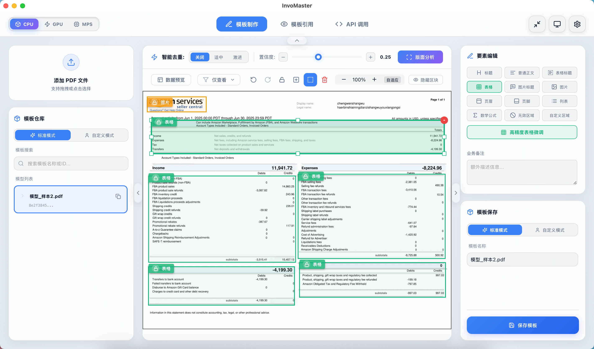
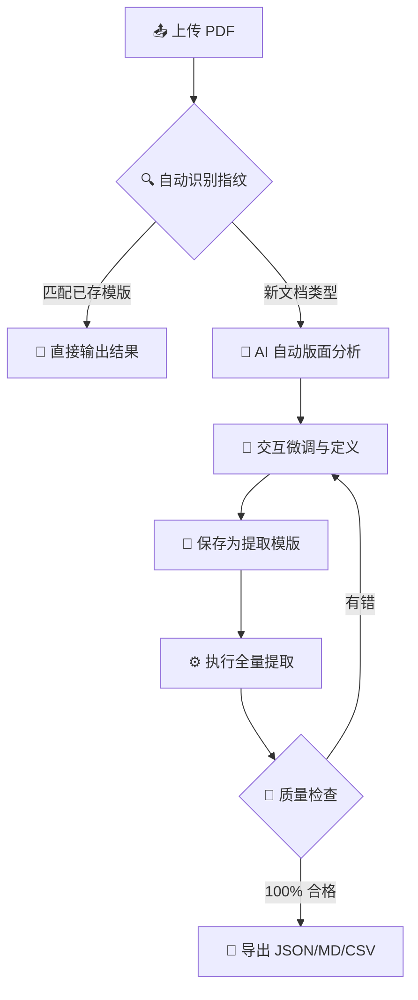

<div align="center">
  
  <h1>InvoMaster | 票据专家</h1>
  <p><b>基于 HITL 设计的高精度行业 PDF 数据提取解决方案</b></p>

  <p>
    
    
    
    
    
  </p>
</div>

---

## 🌟 什么是 InvoMaster？

**InvoMaster (票据专家)** 是一款专为处理复杂行业 PDF（如制造业单据、财务报表、技术说明书）而设计的智能提取平台。它融合了深度学习布局分析、自研表格提取引擎和 **Human-In-The-Loop (HITL)** 交互机制，将 AI 的效率与人工的精准度完美结合，确保关键数据提取的 100% 可靠性。

### 🖼️ 软件截图



---

## ✨ 核心优势

- **🚀 智能布局分析 (AI-First)**: 集成 `DocLayout-YOLO` 深度学习模型，针对制造业单据进行三重优化（分辨率增强、启发式修正、图像增强），精准识别文本、表格、图表等关键区块。
- **📊 卓越的表格提取**: 支持基于线条、文本对齐和显式坐标的混合提取策略。提供原生 PDF 与 OCR 双重模式，完美应对扫描件及复杂合并单元格。
- **🧩 智能模版系统**: “指纹识别”技术可自动识别文档特征并匹配提取模版，实现“一次定义，无限复用”。
- **✍️ 可视化交互编辑**: 专为数据采集人员设计的编辑器，支持实时微调、区块合并、多格式导出，让数据提取像编辑文档一样简单。
- **🔌 工业级 API 支持**: 除了桌面客户端，系统内置轻量级高性能 API，可轻松集成到现有的自动化流水线中。

---

## 🏗️ 技术架构

InvoMaster 采用现代化的前后端分离架构，通过桌面壳程序 (`PyWebView`) 提供流畅的端侧体验。

### 后端 (Python Stack)
*   **API**: [FastAPI](https://fastapi.tiangolo.com/) - 异步高性能 Web 服务。
*   **分析引擎**: [DocLayout-YOLO](https://github.com/DocLayout/DocLayout-YOLO) - 文档视觉识别旗舰。
*   **基础工具**: `pdfplumber` + `OpenCV` + `NumPy`。
*   **OCR 系统**: [RapidOCR](https://github.com/RapidAI/RapidOCR) (ONNX 加速)。
*   **包管理**: [uv](https://github.com/astral-sh/uv) - 超快速构建与运行环境。

### 前端 (TypeScript/React Stack)
*   **核心**: `React` + `Vite`。
*   **交互**: `Framer Motion` (动画) + `Lucide Icons`。
*   **渲染**: `react-pdf` 深度定制化预览器。

---

## 📊 数据提取闭环



---

## 🚀 开发者快速上手

### 预备工作
*   安装 Python 3.10+
*   安装 Node.js 18+
*   (推荐) 安装 [uv](https://github.com/astral-sh/uv)

### 本地运行
1. **启动后端/前端演示模式**:
   如果你想快速查看应用界面，可以直接运行桌面入口：
   ```bash
   python run_desktop.py
   ```

2. **开发模式部署**:
   - **后端**:
     ```bash
     cd backend
     uv sync
     uv run python main.py
     ```
   - **前端**:
     ```bash
     cd frontend
     npm install
     npm run dev
     ```

### 项目构建
我们提供了全自动化的构建脚本：
```bash
# 构建 macOS App 或 Windows 绿色包
python build_app.py
```

---

## 📄 开源协议

本项目基于 **MIT License** 开源。

---

<div align="center">
  <p>Made with ❤️ by InvoMaster Team</p>
</div>
