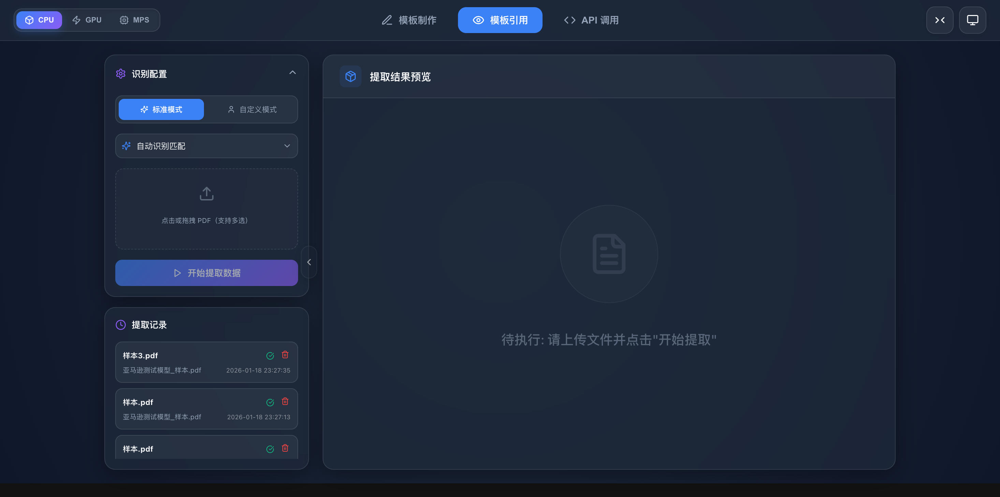
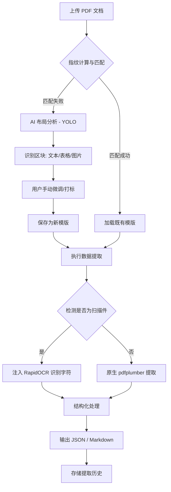

# Industry PDF Data Extraction - 行业 PDF 数据提取工具

一个基于 **HITL (Human-In-The-Loop)** 设计思想的行业 PDF 数据提取平台。通过深度学习布局分析、高精度 OCR 和智能模版匹配，实现对各类复杂 PDF 文档（如行业报告、财务报表、技术说明书等）的结构化提取。



## 🌟 主要功能

- **智能布局分析**: 采用 `DocLayout-YOLO` 模型，自动识别 PDF 中的文本、标题、表格、图片、公式等元素。
- **高精度表格提取**: 支持基于线条、文本对齐和显式坐标的表格识别策略，可精细调节表格结构。
- **混合 OCR 引擎**: 自动检测 PDF 扫描状态，对无文本层或识别不佳的区域调用 `RapidOCR` 进行文字识别。
- **智能模版系统**: 支持“指纹识别”功能，对于同类型的文档可自动匹配已有的提取模版，实现一键批量处理。
- **可视化编辑器**: 提供交互式界面，用户可手动调整识别框、定义字段标签及备注，确保提取结果 100% 准确。
- **多格式导出**: 支持将提取结果导出为 JSON 和 Markdown（表格保持结构化）。

## 🧠 版面分析优化策略

为了应对制造业单据、复杂报表等高难度场景，本项目在 `DocLayout-YOLO` 基础上实施了三重优化：

1.  **高分辨率推理 (Resolution Boost)**: 默认将模型输入尺寸 (`imgsz`) 从 1024 提升至 **1280**。这使模型能更清晰地识别细小的单元格边框和密集的文本排版。
2.  **制造业单据启发式修正 (Heuristic Class Correction)**: 针对宽大表格容易被误判为“图片 (Figure)”的问题，增加了宽度动态判定。凡是宽度超过页面 50% 的区域且类别为图片时，系统会智能将其修正为“表格 (Table)”，大幅提升单据处理的自动化率。
3.  **图像预处理增强 (Image Enhancement)**: 在推理前引入了图像增强流水线，包括：
    *   **自动对比度拉伸**: 消除背景噪点，使线框更黑白分明。
    *   **锐度增强**: 强化边缘特征，辅助模型在模糊扫描件下依然能精准定位表格边界。

---

## 🛠 技术架构

该项目采用前后端分离架构，核心技术栈如下：

### 后端 (Backend)
- **框架**: [FastAPI](https://fastapi.tiangolo.com/) - 高性能的异步 Python Web API 框架。
- **布局分析**: [DocLayout-YOLO](https://github.com/DocLayout/DocLayout-YOLO) - 针对文档布局优化的 YOLO 模型。
- **文本/表格处理**: [pdfplumber](https://github.com/jsvine/pdfplumber) - 强大的 PDF 文本与表格信息提取工具。
- **OCR 引擎**: [RapidOCR](https://github.com/RapidAI/RapidOCR) - 基于 ONNX Runtime 的高性能 OCR，适配中文与复杂排版。
- **数据库**: [SQLite](https://www.sqlite.org/) - 存储模版元数据、字段定义及提取记录。
- **包管理**: [uv](https://github.com/astral-sh/uv) - 超快速的 Python 包安装与环境管理工具。

### 前端 (Frontend)
- **框架**: [React](https://reactjs.org/) + [Vite](https://vitejs.dev/) - 现代前端开发环境。
- **UI 库**: [Lucide React](https://lucide.dev/) (图标), [Framer Motion](https://www.framer.com/motion/) (动画)。
- **PDF 渲染**: [react-pdf](https://github.com/wojtekmaj/react-pdf) - 高性能 PDF 预览与交互。
- **样式**: CSS Modules / Vanilla CSS (现代简约风格)。

---

## 📊 数据提取流程



---

## 🚀 快速开始

### 1. 克隆项目
```bash
git clone https://github.com/your-repo/industry_PDF.git
cd industry_PDF
```

### 2. 后端部署
推荐使用 `uv` 环境管理：
```bash
cd backend
uv sync
uv run python run_server.py
```
或使用传统方式：
```bash
cd backend
pip install -r ../requirements.txt
python run_server.py
```
后端服务将运行在 `http://localhost:8291`。

### 3. 前端部署
```bash
cd frontend
npm install
npm run dev
```
前端服务将运行在 `http://localhost:5173`。

---

## 📖 使用示例

1. **上传文档**: 在首页上传需要处理的 PDF。
2. **AI 分析**: 系统会自动运行 YOLO 模型识别页面结构。
3. **微调区域**: 如果是表格，可以点击“表格微调”按钮，调整行列分割线。
4. **保存模版**: 对于周期性文档，输入模版名称并保存，下次相同格式的文档将自动匹配。
5. **获取数据**: 点击“提取数据”，实时查看侧边栏生成的结构化 JSON/Markdown 结果。

---

## 📄 许可证

基于 MIT 许可证开源。请在使用时遵守相关法律法规，保护数据隐私。
